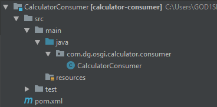

# Calculator Consumer Bundle

After running <code>mvn clean install</code>, you can find the bundle in the <b>target</b> folder.

## Project structure
</img>

## Notes
A very important thing to make sure you don't forget to add into the <b>pom.xml</b> file of Maven projects which generate bundles through the Apache bundle plugin is this line: <code>&lt;packaging&gt;bundle&lt;/packaging&gt;</code>.

## Installation instructions

#### Guide for [Apache Karaf](https://karaf.apache.org/)
 - Download the OSGi container.
 - Run the <b>karaf</b> executable in the <b>bin</b> folder.
 - Install the [Service Component Runtime](https://felix.apache.org/documentation/subprojects/apache-felix-service-component-runtime.html) with the `feature:install scr` command.
 - Install this bundle onto the container using `install file://{PATH_TO_YOUR_BUNDLE}`.
 - Install the [Calculator Provider](https://github.com/danielgospodinow/Calculator-OSGi/tree/master/CalculatorProvider) bundle.
 - Check the Bundle IDs and run `start {BUNDLE_ID}` for both. In case you can't find them, you can always check all of the installed bundles with the `list` command and get the IDs from there.

#### Guide for [Knopflerfish](https://www.knopflerfish.org/)
 - Download the OSGi container.
 - Navigate to the <b>osgi</b> folder.
 - Run from the console `java -jar framework.jar`
 - From the navigation menu select <b>Open Bundle File...</b>.
 - Add this and the [Calculator Provider](https://github.com/danielgospodinow/Calculator-OSGi/tree/master/CalculatorProvider) bundle.
 - Right click over both bundles and select <b>Start Bundle</b>.

 The order in which you install the provider and consumer bundle doesn't matter.